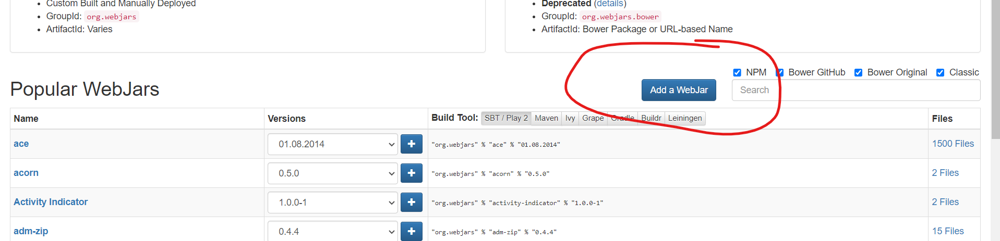
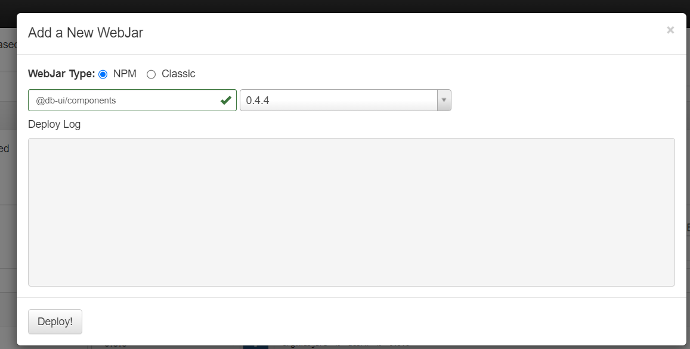

# SpringBoot + DBUX

This is a simple example how to use DB UX npm libraries with SpringBoot.

You need to add npm packages to [webjars](https://www.webjars.org/) via "Add web jar" button:

Select ``npm`` and paste the name of the npm library into the input (in this example `@db-ui/components`) and select a version. Press "Deploy!" afterward:

